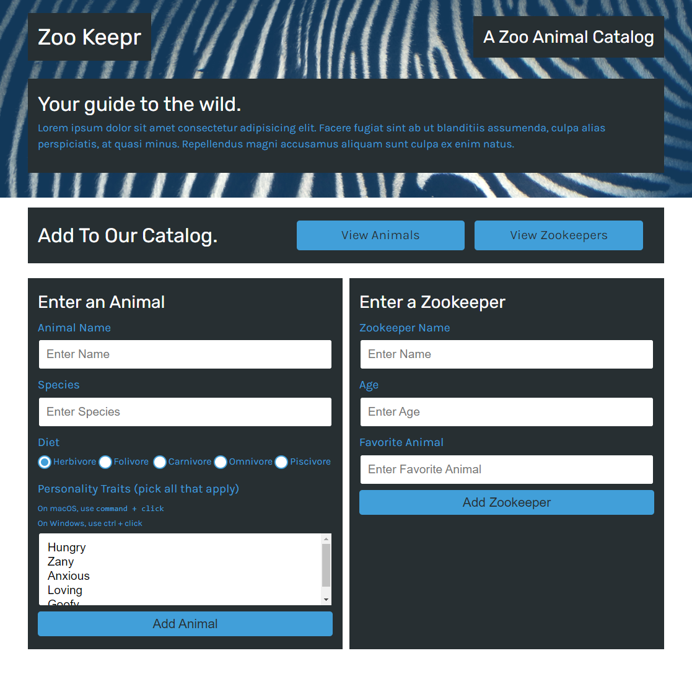
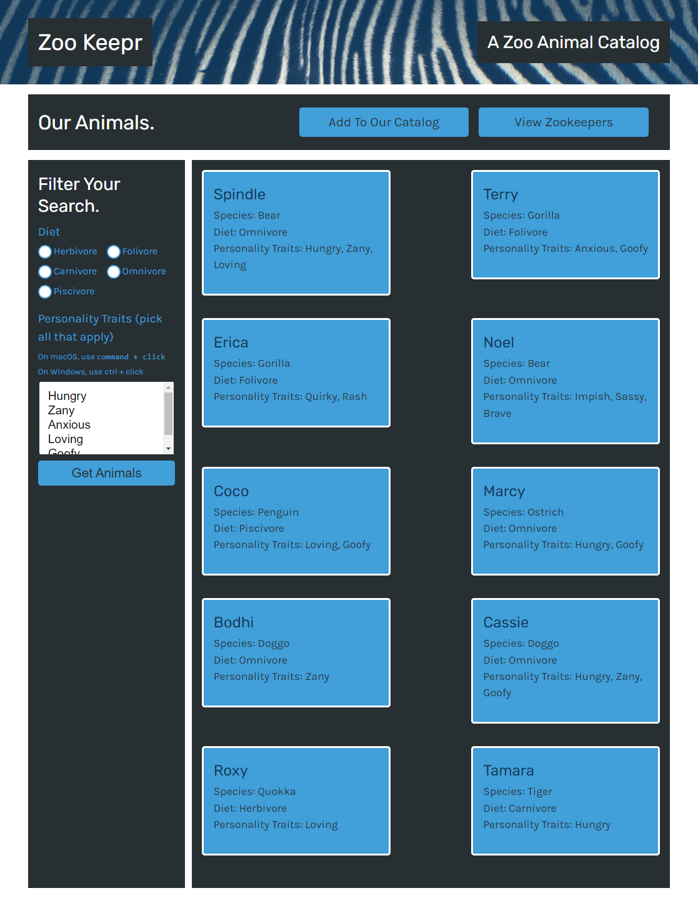
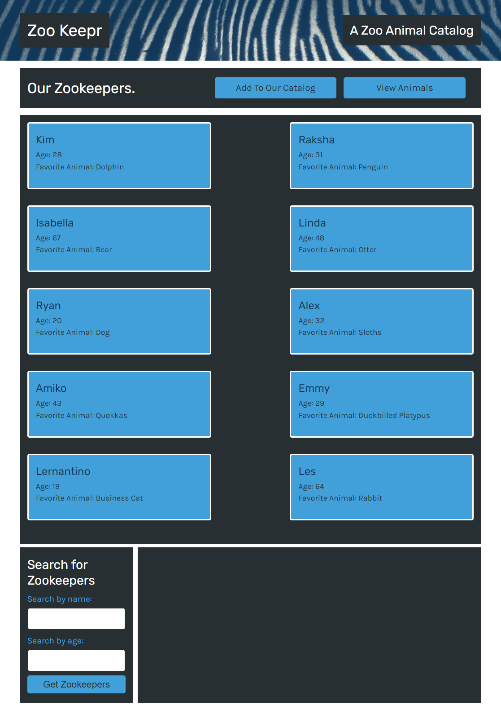

# Zoo Keepr

## Table-of-Contents

- [Description](#description)
- [Deployed Site](#deployed-site)
- [Features](#features)
- [Technologies](#technologies)
- [Future Development](#future-development)
- [Credits](#credits)

## Description

This is my eighth project for the University of Oregon Coding Bootcamp 2022. In this project, I create a web server using the Express.js framework and add it to a front-end application named Zoo Keepr. This site is hosted on Heroku.

## Deployed Site

Follow [this link](https://morning-sierra-44507.herokuapp.com/) to view and use our site!

## Features

This is how the site appears to viewers. It is responsive, adapting to multiple screen sizes.

Users can view the current catalog of animals by pressing the "view animals" button. The page redirects to show cards with all of the current animals information on them, such as name, species, diet, and personality trait. Users can also use the form to the left of the page to filter the results of the animals currently shown. Users can filter by diet or personality trait.

Users can also navigate to the current catalog of zookeepers by pressing the "view zookeepers" button. Just like with the animals, the page redirects to show cards with all of the current zookeepers' information, such as name, age, and their favorite animal species. Users can also use the form at the bottom to filter by name or age.

On the main Zoo Keepr page, users can add animals or zookeepers to the catalog. The form to the left allows users to enter information for a new animal, ushc as name, species, diet, and personality traits. The form to the right allows users to enter information for a new zookeeper, such as name, age, and favorite animal species. Once the user clicks "add animal" or "add zookeeper", that information is included in the database. If users navigate to the animal or zookeeper page, they will now see a card generated with the new animal or zookeeper's information.

## Technologies

- HTML
- CSS
- JavaScript
- Node.js
- Express.js

## Future Development

In the future, I would like to add the following improvements:

- There is a current known bug that does not allow users to properly add a new animal.
- I would like to change the layout of the zookeepers page so that the form appears on the left side reliably like the animals page does.
- A feature that allows users to filter or search the zookeepers.
- A better database implementation other than a json file.

I'm always interested in refactoring code to improve it's functionality. If you would like to suggest your own improvements, you can reach our development team at the links below.

- <a href="mailto:ashlynn4567@gmail.com">Email</a>
- <a href="https://github.com/ashlynn4567">GitHub</a>
- <a href="www.linkedin.com/in/Ashley-Lynn-Smith">LinkedIn</a>

## Credits

This project was built with the help of the University of Oregon's Coding Boot Camp.

## Licensing

The application is covered under the following license: [MIT](https://opensource.org/licenses/MIT)
